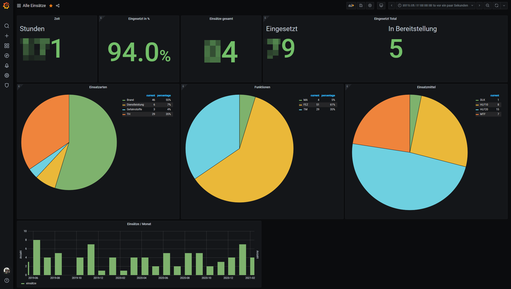
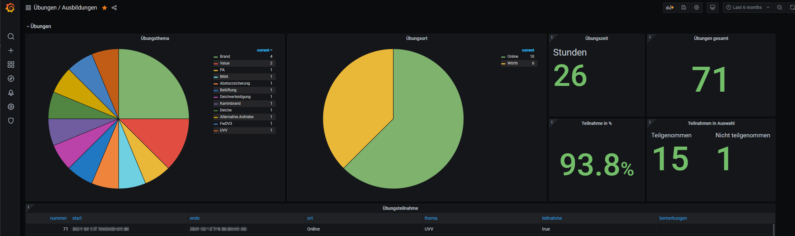
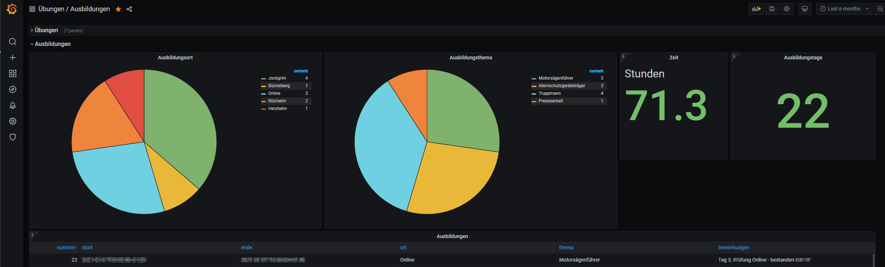
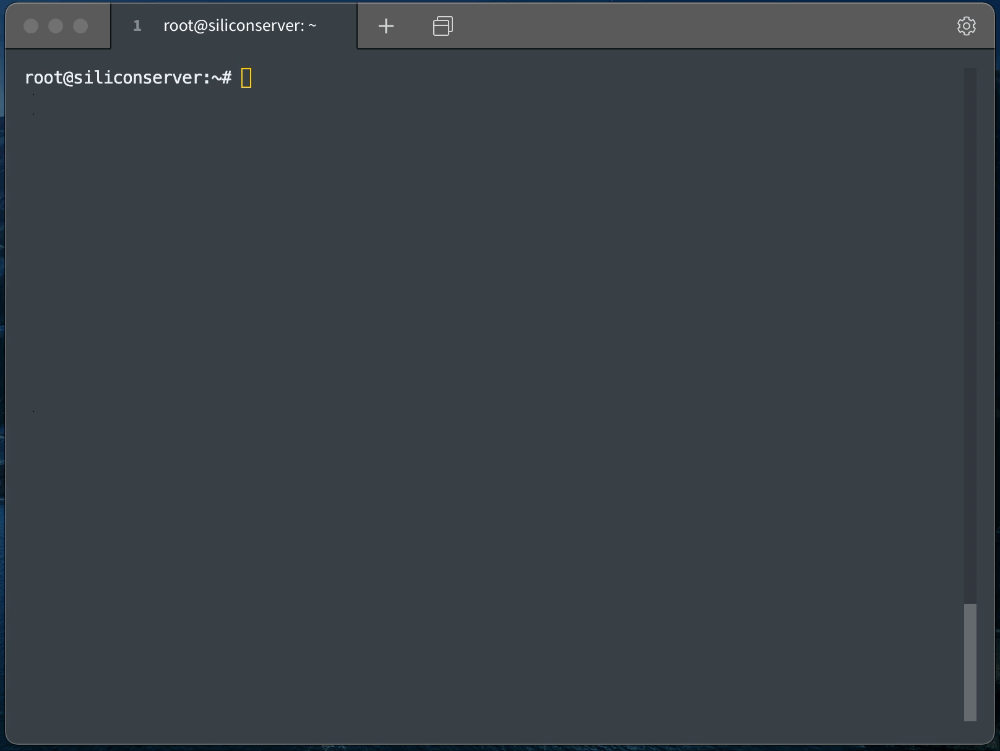

# Einsatzstatistik

## Tree view
```
.
├── README.md
├── dashboards
    ├── uebungen_ausbildung.json
│   └── einsaetze.json
├── db
    ├── database-update.sql
│   └── database.sql
└── scripts
    ├── ausbildung_del
    ├── ausbildung_neu
    ├── einsatz_del
    ├── einsatz_neu
    ├── uebung_del
    └── uebung_neu

3 directories, 9 files
```

## Dashboards folder
Contains several Grafana Dashboards as json Files. Can be easily imported in Grafana.

**Einsatz Dashboard:**


**Übungen Dashboard:**


**Ausbildung Dashboard:**


## DB folder
Contains the PostgreSQL initialdump for all the scripts and dashboards.
Update Script for updating old Databases is here as well.

## Scripts
Contains scripts to add and remove entries for Ausbildung, Einsatz and Übung to database.

**Example Einsatz Neu:**  
Shows the last DB row to may remind you what the new Einsatznummer would be.  
After you've entered the number, it will ask you about date and time, where it took place, kind, vehicle, your role, asks if you have worn SCBA and much more.  
  
See an example here:  


**Example Einsatz Delete:**  
Shows the last DB row to may reming you which Einsatznummer you would like to delete.  
Asks you only for the Einsatznummer and deletes the matching row from the database. 
  
See an example here:  


## License
Everything published inside this repository is under MIT License.
